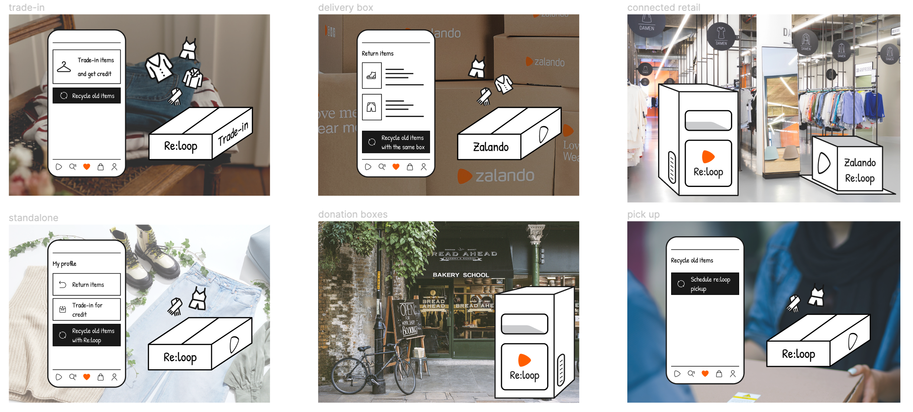
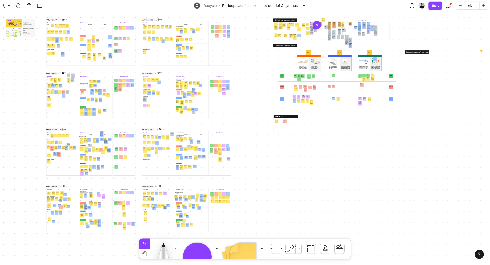
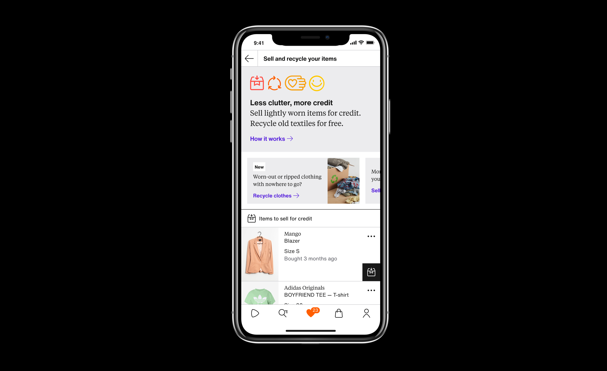
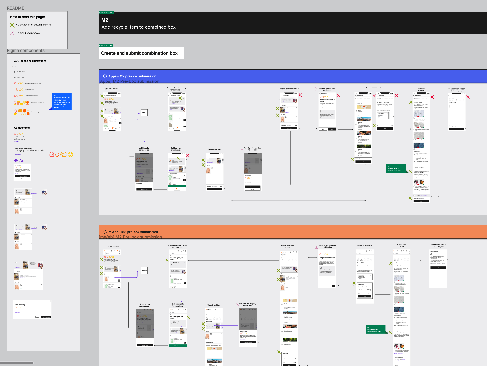

## Recycle with Zalando

**Role:** project lead and main contributor

**Time:** January 2022 - July 2022

### Quickread

As a Principal Product Designer at Zalando Recommerce, I led the conceptualisation and testing of the customer experience design of Zalando new textile recycling service. The project started from an early exploration of different scenarios based on existing user research, then progressed to the design and testing with customers, ultimately developing a live product that will be shipped in 2023 as a pilot in 3 Zalando markets.

### Some context: what was this project about?

As a Principal Product Designer at Zalando Recommerce, I am responsible for the design of the user experience of customers who buy second hand fashion from Zalando and customers who sell second hand items via the Zalando trade-in service.

In December 2021, my team was approached by the Zalando sustainability team asking for  support in exploring the idea of a textile recycling service, to help Zalando customers dispose of unwearable textiles.

By then, the Zalando sustainability team had already performed a set of quantitative surveys that gathered some insights around the problem space: based on the surveys’ answers, it was clear that customers struggle to dispose of their old clothes in a sustainable yet easy way, as well as not trusting the sustainability of using existing disposal options (recycling or donation bins).

### What was the design challenge?

The project initially started with the smaller challenge of helping the sustainability team visualise different scenarios for the customer experience and discuss them internally at Zalando.

However, the project challenge eventually evolved in designing a customer experience to enable customers to sell and recycle old clothes on Zalando.

### How I approached it:

**Starting with scenario visualisation**

The initial request for this project was to explore different scenarios for a recycling service, so to discuss potential strategic opportunities and challenges ahead.

In order to do so, I set up a small unit consisting of a colleague product designer and the head of circularity at Recommerce — who was the project sponsor and the main contact point with the broader sustainability organisation at Zalando. Each person of this working unit brought specific strength to the table: my team’s product designer was an expert in our service and customers (having been in the team for several years already), the head of circularity provided up to date insights on Zalando sustainability strategy and I brought a broader understanding of different Zalando customers and products based on my previous experiences in the company.

After collecting and recapping all existing knowledge on the problem space — mainly coming from existing Zalando customer surveys on the topic, but also collecting a few benchmarking ideas from competitors and market trend reports — we brainstormed different solution and eventually condensed them into 6 scenarios:

1. Integrating with the Zalando Pre-owned trade in service, allowing customers to sell and recycle clothes in the same go
2. Leveraging the returns box
3. A physical recycling drop-off box in Zalando connected retail partners’ stores
4. A standalone recycling service on Zalando
5. Donation and recycling boxes placed on the street
6. A more premium recycling service for Zalando Plus customers that includes parcel pick-up

After brainstorming these scenarios, I created sketches of the ideas and handed over to the head of circularity colleague, who then presented to Zalando sustainability leadership. The result of this process was a green light to explore further the first idea: integrating recycling with the existing Zalando trade-in service.

This idea was picked based on a few hypothesised strategic opportunities: first, that Zalando customers would benefit from a unified service to dispose of clothing (both for selling as well as for recycling) and second, because such a concept would allow Zalando to test the recycling service without having to set up a new technical and logistics infrastructure.

**Evaluating the opportunity area**

Having defined the scope and objectives of the project, we set out to better understand whether the hypothesis would meet customer desirability, and how. 

Based on the existing customer research insight, I facilitated an exercise to define the value proposition and various assumed benefits. Then, such benefits were turned into research questions and visualised through lo-fidelity sacrificial concepts to be shown to customers in qualitative interviews.

Splitting interviewing duties between a user researcher colleague and myself, we interviewed about 12 people that were selected following screening criteria that would help us uncover meaningful insights (eg: we picked both people who had recycled textiles before, as well as people who never did it). Synthesising the learnings from the interviews, we learned that the proposed concept of integrating a textile recycling service with the Zalando trade-in process was well received. We were able to further sharpen the concept by evaluating the impact of the different benefits that were proposed, based on situational evidence described by interviewees when describing it their stories and past experiences with recycling.

**Designing the solution and iterating on it**

Having collected a robust set of insights about the concept and some evidence of customer desirability, I moved into the solution design phase. Together with the project product manager, we identified some metrics to focus on when designing the solution: number of boxes sent to Zalando for recycling, as well as the number of boxes sent to Zalando that contains both items for recycling and trade-in.

When designing the customer experience, I looked at two customer journeys of two user personas: existing and new Zalando customers that need to dispose their unwearable textiles, as well as wanting to sell some old clothes still in good shape.

The two user journeys presented a few challenges: findability of the new service (“how might we help customers find out about recycling at Zalando?”), integration with the trade-in service (“how might we enable customers declutter their wardrobe in a seamless way, selling or disposing of recyclable clothing?”) as well as clarity over packing instructions (“how might we provide customers clear instructions to pack the items to be shipped for recycling?”).

The solution design phase went through two iterations based on feedback received via usability testing sessions with customers.

**Delivering the specs for development**

As the solution went into development sprint, my role shifted to providing specifications to the engineering team, as well as collaborating with visual designers and content designers to produce the final version of illustration, iconography and copy.

The design of iconography and illustrations was done together with members of the Zalando Design System team, leveraging their expertise and illustration skills. The new visual assets were added to the design system library through the team contribution model.

Content and copy design was also reviewed and aligned with the content design team — leveraging their expertise on the craft — with the Zalando sustainability team and legal team, to ensure communication would match the company principles, and to avoid greenwashing and unlawfulness claims.

Ultimately, the developed solution was reviewed through an extensive set of QA exercises looking at functionality, UI implementation and copy localisation.

### Outcome

Recycle with Zalando was initially launched as an A/B test to evaluate its integration with the logistic systems needed to operate the recycling service to live customers (ie: handling shipments, sorting and delivery to recycling partners of recycling textiles).

However, the original launch timeline of the full scale pilot in three Zalando live markets was delayed to mid 2023, due to a change in budget allocation for operating the new service. The recycling pilot is set to run for 3 months, during which the team will evaluate its performance based on the KPI identified at the beginning of the project.

---

## Zalando second hand customer journey

**Role:** project lead and main contributor

**Time:** January 2022 - March 2022

### Quickread

After joining the Recommerce team in late 2021, my role was to lead a user research round to evaluate the existing Zalando second hand fashion customer journey and identify opportunities for improvements. In the same research setting, based on existing research that pointed out the need for better curation of the assortment, I evaluated a proposed design for a “themed landing page” to inspire Zalando customers through curation and storytelling of the assortment. The result of this project was a set of actionable insights to refine the future product strategy of Zalando second hand, and the launch of an iterated version of the themed page.

---

## Zalando Design Methods Toolkit

**Time:** 2019 - ongoing

Enabling the Zalando Product Design community of practice to collaborate more efficiently and plan project more flexibly by a shared understanding of design methodologies.

My role in this project was to compile design methods and case studies leveraging the expertise and experience of other Zalando colleagues (much of the Toolkit content was contributed by other designer and user researchers at Zalando), to maintain the Toolkit by managing contributions and amendments and to communicate it to the design community at Zalando.

The methods toolkit initiative follows the principles for effective change management: providing resources and knowledge about design methods and activities, backing knowledge with practical examples and case studies from past Zalando projects, and establishing rituals to learn about the toolkit (new joiners onboarding and ad-hoc enablement sessions) as well as encouraging a shared ownership by involving other colleagues to contribute new methods and case studies to the Toolkit.

To measure its performance in the community and identify opportunities for improvement, I run a recurring survey sent to the Product Design team at Zalando - together with the Design Ops team.

---

## Zill-it-in, a Figma plugin

**Role:** project lead and co-owner

**Time:** 2020 - ongoing

Originating from a Zalando Hackathon project, I led the development and maintained a Figma plugin that allows Zalando designers to pull live content from the Zalando website (product images and data) and automatically populate design system components with it.

The goal is to enable designers to produce high fidelity prototypes quicker, relying on an almost instantaneous content fetching service.